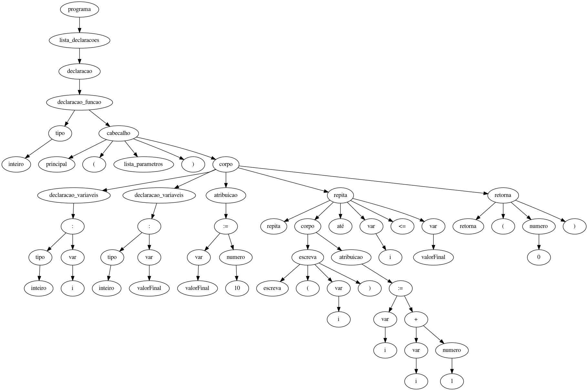

# Análise Semântica

> Etapa responsável por fazer verificações de erros de tipo e concordância, pois mesmo programas gramaticamente corretos ainda podem conter erros

## Processo de análise semântica
A etapa de análise semantica é responsável por fazer diversas checagens, no entanto, antes de iniciar o processo de verificação, foi realizada a podagem da árvore, assim eliminando determinados nós, como por exemplo "acao" e "expressão", para que assim facilite a análise, eleminando nós que não possuem grande importância nessa etapa.



Após a poda da árvore sintática é hora de percorrer a árvore acima para obter informações a respeito do ccódigo recebido como entrada, para que posteriormente seja possível com informações como nome, escopo, parametros, dimensão, dentre outras, realizar a montagem de uma tabela de símbolos. Na prática desse trabalho foi utilizado uma lista de objetos para implementar a tabela citada anteriormente.
A análise semântica pode ser separada em duas categorias, um delas relacionada ao fato de verificar erros e garantir a execução apropriada e a segunda relacionada a otimização do programa, ou seja, formas de melhorar a execução. No caso deste trabalho o foco foi na verificação de erros, ou seja, fazer um sistema didático funcional, no entanto, futuramente a ideia de aplicar a otimzação também é algo a ser discutido.
Após o preenchimento da tabela de símbolos é necessário fazer as verificações semânticas, como verificar se determinadas atribuições são compatíveis, ou seja, se o tipo delas são compatíveis ou se precisam fazer alguma conversão como um casting, como será mostrando no exemplo a seguir que possuí a soma de uma variável inteira e outra em ponto flutuante, algo que requer ou a manipulação fazendo a conversão, ou retornar um erro usuário, neste caso foi escolhido fazer o casting.

```
inteiro: a
flutuante: b
inteiro: a + b
```

Um outro ponto mais simples, porém que requer atenção é no caso de fazer a verificação se o código  póssui um programa principal, além de outras verificações como no caso de arrays e suas posições, se está havendo acesso em posições inexistentes por exemplo.

```
inteiro: a[1]
escreva( a[2] )
```

Além  verificações de variáveis, arrays, também são realizadas verificações em funções, como verificação de chamadas e até se as funções estão sendo utilizadas, ou se apenas estão declaradas no escopo do programa.