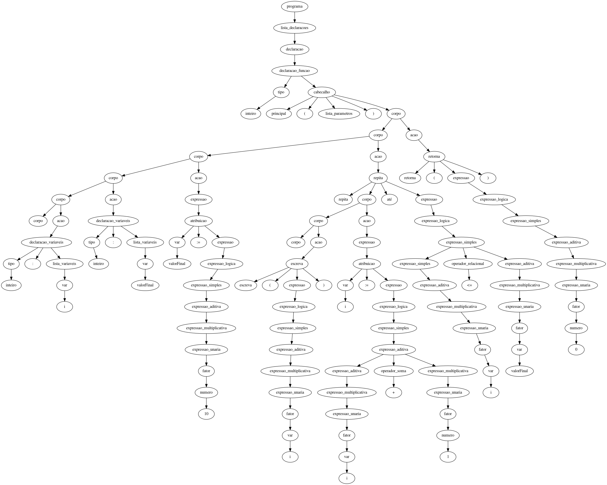

# Análise Sintática

> Etapa responsável por determinar a estrutura sintática de um programa ou código fonte

## Processo de análise sintática
Basicamente o processo de análise sintática se inicia com o recebimento dos tokens resultantes do processo de análise léxica, está que de acordo com o código .tpp passado como entrada, retorna os tokens. No desenvolvimento desta análise, diferentemente da análise léxica que utiliza expressões regulares para fazer a identificação dos tokens é utilizada gramáticas livres de contexto, pois é necessário fazer a análise da precedência dos operadores, algo que as expressões regulares não conseguem suprir.
Nesta etapa é realizada a análise das sequência de tokens utilizando o módulo yacc do Ply, no qual são criadas regras para que assim seja possível distinguir as sequências válidas de tokens e apontar possíveis erros.
No contexto de algoritmos para fazer a análise sintática há basicamente duas categorias gerais de algoritmos, os que fazem a análise de maneira ascendente e os que fazem de maneira descendente, a descendente constrói a árvore resultante de cima para baixo e a ascendente, está que foi utilizada neste trabalho e que ao contrário da análise anterior monta a árvore de baixo para cima, inicializando pelas folhas nesse caso.

A árvore sintática é montada de acordo com os tokens e as regras configuradas e por fim a árvore é retornada como entrada para a próxima etapa do compilador. Nesta etapa a árvore é retornada sem podas, no entanto esta mesma será podada posteriormente. 