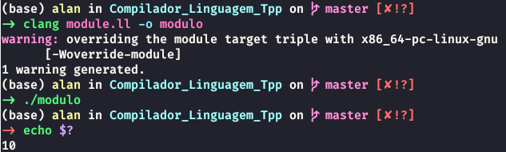

# Geração de código

> Nesta etapa é utilizada a biblioteca do python LLVM para fazer a geração do código intermediário, compilação e posterior execução do código de entrada

## Processo de geração de código
```
Na etapa final do compilador foi utilizada uma estrutura LLVM para fazer o processo de geração de código, no qual é uma infraestrutura bem organizada e que nos permite trabalhar em diferentes níveis como frontend, backend, além também de poder trabalhar com otimização.
```

### Exemplo de funcionamento:
```
from llvmlite import ir
# Cria o módulo.
module = ir.Module('meu_modulo.bc')
# Salva o Módulo.
arquivo = open('meu_modulo.ll', 'w')
arquivo.write(str(module))
arquivo.close()
print(module)
```

O exemplo mostra o funcionamento de módulos no contexto do LLVM, com a criação de módulos, utilizando a biblioteca llvmlite no python.
A llvmlite basicamente é utilizada para escrever compiladores just in time e a biblioteca possuí inúmeras funções para fazer a geração de código, como geração e alocação de variáveis, sejam estas locais ou globais, além também de estruturas básicas como if, passagem de parâmetros dentre diversas outras disponíveis.
O código acima funciona da seguinte maneira, primeiramente é feita uma importação referente ao módulo IR, esta que é responsável por fazer a geração de código intermediário. O funcionamento do arquivo consiste na criação de um módulo nomeado de `meu_modulo.bc`, após isto é adicionado as funções responsáveis por fazerem a geração de código, no entanto, como este é um exemplo, não há funções. Por fim é realizado a escrita do arquivo, ou seja, basicamente salvar o módulo como `meu_modulo.ll`, para que posteriormente seja realizada a compilação do módulo.
Após a criação do módulo com a execução do compilador é necessário fazer a compilação do módulo, para que assim seja gerado um executável. Foi utilizado o clang seguindo os exemplos deixados pelo professor e o comando usado para fazer é o seguinte:

```
$ clang modulo.ll -o modulo
```

Após a compilação, para executar o programa recém compilado é necessário a execução de outro comando para que desta vez seja realizada a execução do programa, além também da execução do segundo comando que é responsável por mostrar a saída resultante.

```
$ ./modulo
$ echo $?
```

### Observação
As funções de escritas e leitura necessitam da implementação do arquivo `ìo.c`, ou seja, quando algum programa tiver leitura e escrita é necessário fazer a compilação do `modulo.ll` juntamente com `ìo.ll`, como no comando abaixo.

```
$ clang modulo.ll io.ll -o modulo
```

#### Código

```
#include <stdio.h>

void escrevaInteiro(int inteiro) {
  printf("%d\n", inteiro);
  
}

void escrevaFlutuante(float flutuante) {
  printf("%f\n", flutuante);

}

int leiaInteiro() {
  int numero;

  scanf("%d", &numero);

  return numero;
}

float leiaFlutuante() {
  float numero;

  scanf("%f", &numero);

  return numero;
}
```

#### Execução do projeto

